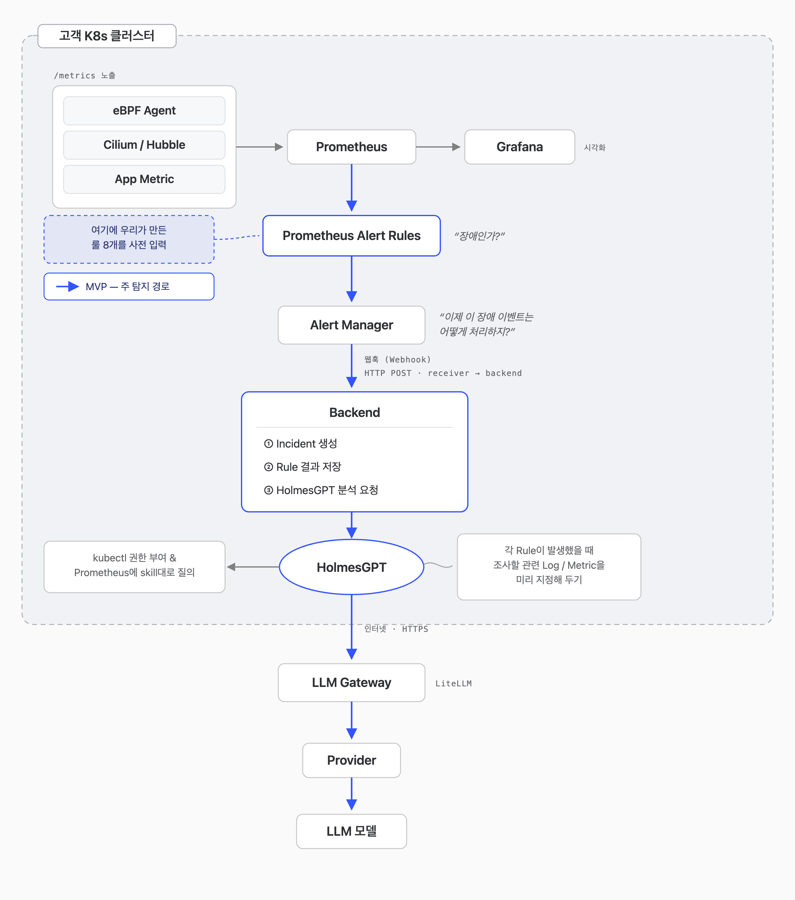

# NetworkDoctor

> eBPF와 Prometheus로 Kubernetes 네트워크 장애 신호를 수집하고 HolmesGPT로 원인을 추론하는 Incident 진단 도구

NetworkDoctor는 Kubernetes 클러스터에서 발생하는 네트워크 장애를 더 빠르게 관찰하고 진단하기 위한 졸업 프로젝트입니다.

노드마다 붙인 eBPF 에이전트가 커널 네트워크 신호를 Prometheus 지표로 내보내고, Prometheus 룰이 8가지 장애 시나리오를 탐지합니다. 알림이 오면 backend가 인시던트를 만들고 근거 지표를 모은 뒤, HolmesGPT에게 시나리오별 스킬로 원인을 조사시켜 결과를 JSON과 Markdown 리포트로 남깁니다.

## 현재 상태 (2026-10-06)

| 영역 | 상태 |
| --- | --- |
| 탐지 | eBPF 에이전트 + Prometheus 룰 **Rule 1~8** 동작. 온프렘 랩(워커 3대)에서 8개 모두 실제 장애로 발화 확인 |
| 인시던트 | Alertmanager 웹훅 → 멱등 저장(PVC) → 같은 노드·서비스 알림을 한 그룹으로 묶어 조사 1회 |
| 원인 조사 | HolmesGPT + 시나리오 스킬 8종. 스킬은 알림 라벨을 보고 스스로 선택(backend가 이름을 지정하지 않음) |
| LLM | 클러스터 밖 LiteLLM 게이트웨이 경유. 기본 모델 `gateway-luna`, 조사 1회 약 $0.04 |
| 재현 | `scripts/repro/`로 Rule 1~8 장애를 자동 주입·복구하고 PASS/FAIL 판정 |
| 정확도 | 계산을 코드가 맡는 구조 적용으로 해당 장애 원인 분석 정확도 49% → 83% (평가 하네스 `eval/`) |
| 배포 | Helm 차트 3종 + Argo CD 앱-오브-앱(수동 Sync), 이미지는 커밋 SHA 태그로 고정 |

## Architecture



```text
온프렘 Kubernetes (kubeadm 1.35 · Cilium 1.19)
├─ eBPF agent DaemonSet (hostNetwork, privileged)
│  └─ TCP 재전송·RTT·cwnd·연결 실패, DNS 지연, 런큐 지연 → ebpf_* :9102
│
├─ kube-prometheus-stack (기존 스택 위에 얹음)
│  ├─ ServiceMonitor        에이전트 scrape
│  ├─ PrometheusRule        Rule 1~8 (+ Rule 1 cross-node 변형), smoke 5종
│  └─ AlertmanagerConfig    source=networkdoctor 알림 → backend 웹훅
│
├─ networkdoctor backend
│  ├─ POST /webhooks/alertmanager   인시던트 생성 (fingerprint|startsAt 멱등)
│  ├─ 상관 그룹                      같은 노드(없으면 서비스) 10분 창, 그룹당 조사 1회
│  ├─ 증거 수집                      eBPF PromQL 6종
│  ├─ 파생 사실 (derived 구조)        CoreDNS 파드 비율 · 신호 시점차 · conntrack 한도 변화
│  ├─ HolmesGPT 호출 → 공통 스키마 파싱 → report.md
│  └─ POST /eval/runs               구조를 골라 재조사 (평가용, 인시던트 불변)
│
├─ HolmesGPT (공식 차트 래핑)
│  └─ skills/ 8종을 Git에서 받아 Prometheus·k8s 읽기 도구로 조사
│
└─ 데모 앱 Cat Shop (podinfo) + fortio 부하
        │
        ▼
클러스터 밖 VM: LiteLLM 게이트웨이 (가상키·예산) → Anthropic / OpenAI
```

역할 분담: 탐지(firing/resolved)는 Prometheus 룰, 묶기·중복 제거·재전송은 Alertmanager, 인시던트 기록·근거 수집·조사 요청·리포트는 backend, 원인 추론은 HolmesGPT가 맡습니다. backend는 룰이 이미 내린 판정을 다시 하지 않습니다.

움직이는 흐름도와 상세 아키텍처, 평가 결과는 [NetworkDoctor 흐름 지도](https://claude.ai/artifact/9ewb4sPhf9Jn2waoTKwk4J)에 정리했습니다(비공개 링크, 공유 시 열람 권한 필요).

## 탐지 시나리오 (Rule 1~8)

| Rule | 시나리오 | 탐지 조건 요약 | 스킬 |
| --- | --- | --- | --- |
| 1 | 네트워크 혼잡 | 앱 p99 지연 > 0.5s 와 같은 노드 TCP 재전송 > 0.2/s. 다른 노드면 cross-node 변형(info) | `network-congestion` |
| 2 | 커널 네트워크 병목 | softnet 드롭 또는 NIC 수신 드롭 | `kernel-network-bottleneck` |
| 3 | conntrack 고갈 | conntrack 사용률 > 80% 또는 CT 맵 삽입 실패 | `conntrack-exhaustion` |
| 4 | CoreDNS 성능 저하 | CoreDNS p99 > 250ms 또는 SERVFAIL 비율 | `coredns-degradation` |
| 5 | DNS·conntrack 동반 | 같은 노드에서 느린 DNS와 conntrack 50% 이상 | `dns-conntrack-correlation` |
| 6 | 노드 국소 장애 | 한 노드만 TCP 연결 실패율 > 10% | `node-localized-failure` |
| 7 | 애플리케이션 유발 | 5xx 비율 > 5% 인데 네트워크는 조용함 | `application-induced-network-bottleneck` |
| 8 | NetworkPolicy 오설정 | Hubble `POLICY_DENIED` 드롭 | `networkpolicy-misconfiguration` |

룰 정의는 `deploy/helm/networkdoctor/rules/`, 스킬은 `skills/<시나리오>/SKILL.md`에 있습니다.

## 원인 분석 정확도 개선

LLM이 지표 숫자를 잘못 읽어 원인을 틀리는 문제를 줄이기 위해, **비교·계산은 backend 코드가 먼저 하고 Holmes에는 그 결과를 근거로 넘기는 구조**를 적용했습니다. 계산 항목은 CoreDNS 파드별 지연 비율, 지연과 재전송이 오른 시점의 차이, conntrack 한도 변화입니다.

이 구조로 네트워크 혼잡·conntrack 고갈·CoreDNS 지연 장애의 원인 분석 정확도가 **49% → 83%**로 개선되었습니다. 측정 방법은 [eval/README.md](./eval/README.md)에 있습니다.

## Incident Data Model

```text
incident
├─ incident_id, source_alert_key, alert_fingerprint, alert_status
├─ starts_at, ends_at, created_at, updated_at, cluster
├─ severity, rule_id, scenario
├─ symptom_summary, affected_nodes, affected_services
├─ alert_labels, alert_annotations
├─ evidence_metrics           backend가 모은 PromQL 근거
├─ derived_facts              derived 구조의 계산 결과
├─ root_cause_candidates, recommended_actions
├─ holmes_status / holmes_result / holmes_analysis / holmes_tool_calls / holmes_arch
├─ correlation_id, correlated_incidents
└─ recovery_status
```

API: `GET /incidents`, `GET /incidents/{id}`, `GET /incidents/{id}/report.md`, `POST /incidents/{id}/holmes`(재조사), `POST /eval/runs`, `GET /eval/runs/{run}`.

## 배포

설치·검증·롤백 절차는 [docs/deploy-onprem.md](./docs/deploy-onprem.md)에 있습니다. 요약하면 다음과 같습니다.

1. **전제:** Linux 커널 5.8+ 와 BTF, privileged·hostNetwork 허용, kube-prometheus-stack(Operator CRD 포함), OpenAI 호환 LLM 엔드포인트.
2. **차트:** `deploy/helm/networkdoctor`(에이전트·룰·backend), `deploy/helm/holmesgpt`(Holmes + 스킬), `deploy/helm/networkdoctor-demo`(Cat Shop, 랩 전용).
3. **GitOps:** `deploy/argocd/root-application.yaml`가 `deploy/bootstrap/`의 자식 앱을 만듭니다. 자동 Sync는 끄고 사람이 Sync합니다.
4. **이미지:** main에 코드가 바뀌면 CI가 `main-<sha>` 이미지를 올리고, 봇이 랩 values의 태그를 고정하는 `[skip ci]` 커밋을 남깁니다. 그 뒤 Sync합니다.
5. **비밀:** LLM 가상키 Secret(`holmes-llm`)은 Git 밖에서 직접 만듭니다. 모델 키는 클러스터에 두지 않고 게이트웨이 VM에만 둡니다(`deploy/llm-gateway/`).

## Repository Structure

```text
.
├─ .github/workflows/        # agent-ci, deploy-ci, agent-image, backend-image (+ 태그 고정 봇)
├─ bpf/networkdoctor.bpf.c   # 커널 쪽 eBPF 수집기
├─ build/                    # agent, backend Dockerfile
├─ cmd/
│  ├─ networkdoctor-agent/   # eBPF 로더 + Prometheus exporter (Linux)
│  └─ networkdoctor-backend/ # 웹훅 → 인시던트 → 증거 → Holmes → 리포트, /eval/runs
├─ internal/
│  ├─ app/ bpf/ config/ metrics/ model/ worker/          # agent
│  └─ backend/
│     ├─ api/ alertmanager/ incident/ config/ report/    # 웹훅·저장·API·리포트
│     ├─ evidence/ prometheus/                          # 기본 증거 수집
│     ├─ features/                                      # 파생 사실 (derived)
│     ├─ check/                                         # Jev 결론 검사 (derived+jev)
│     ├─ holmes/                                        # Holmes 호출·결과 파싱
│     └─ investigate/                                   # 조사 큐·상관·구조 3종·평가 실행
├─ deploy/
│  ├─ helm/networkdoctor/    # DaemonSet, ServiceMonitor, PrometheusRule(rules/), AlertmanagerConfig, backend
│  ├─ helm/holmesgpt/        # HolmesGPT 공식 차트 래핑 + 스킬 로딩
│  ├─ helm/networkdoctor-demo/ # Cat Shop(podinfo) + fortio
│  ├─ argocd/ bootstrap/     # 앱-오브-앱
│  └─ llm-gateway/           # LiteLLM + Postgres docker compose (클러스터 밖 VM)
├─ skills/                   # 시나리오별 Holmes 스킬 8종
├─ scripts/repro/            # Rule 1~8 장애 재현 · 자동 복구 · PASS/FAIL 판정
├─ eval/                     # 평가 하네스 (cases, expectations, run.py)
├─ docs/deploy-onprem.md     # 온프렘 설치 · 검증 · 롤백
├─ prestudy/                 # 사전 스터디 자료
└─ README.md
```

## Team

| 영역 | 담당 |
| --- | --- |
| Node Agent · eBPF · 지표 수집 | 동욱, 은서 |
| Diagnosis Backend · 원인 조사 · 리포트 | 서영, 은서 |
| Prometheus · Grafana · Helm · 데모 · 배포 | 서영, 동욱 |

## Background

프로젝트를 시작하기 전, 팀원들이 공통 배경지식을 맞추기 위해 Kubernetes/Linux 네트워크, 커널 메트릭, 네트워크 토폴로지를 중심으로 사전 스터디를 진행했습니다. 자료는 [prestudy](./prestudy) 폴더에 있습니다.
